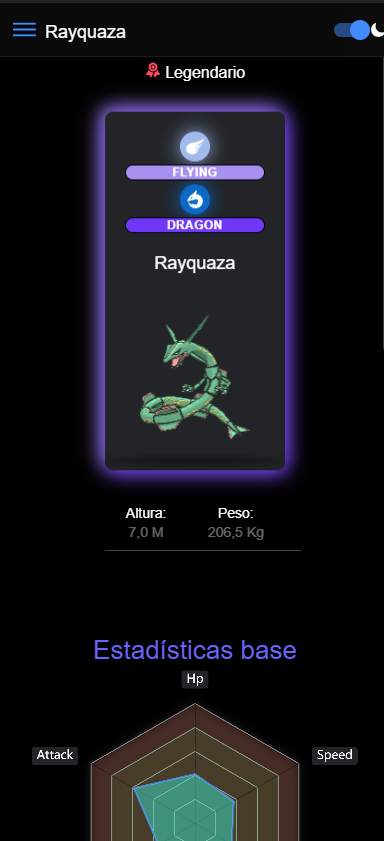

# PokeApp

<!-- Inserta aquí el logo de tu aplicación -->

PokeApp es una aplicación móvil que te permite explorar información sobre Pokémon, ver sus estadísticas, tipos y más. Proporciona una interfaz amigable para descubrir y aprender sobre tus Pokémon favoritos.

## Funcionalidades

- Busca y visualiza información detallada sobre diferentes Pokémon.
- Compara las estadísticas base de varios Pokémon.
- Personaliza filtros para encontrar Pokémon específicos basados en tipos, nombres e IDs.
- Las imágenes de los Pokémon están basadas en modelos en 3D(No Todos). 

## Comenzando

Sigue estos pasos para empezar con PokeApp:

1. **Clonar el Repositorio:** Comienza por clonar este repositorio en tu máquina local:

   ```
   git https://github.com/PePeWee07/PokeApp
   ```

2. **Instalar Dependencias:** Asegúrate de tener instalado el entorno de desarrollo adecuado y todas las dependencias necesarias.

3. **Ejecutar la Aplicación:** Utiliza el entorno de desarrollo para compilar y ejecutar la aplicación en un emulador o dispositivo móvil compatible.


## Capturas de Pantalla

#### Vista de Home

#### Vista de Menu

#### Vista de Pokémones

#### Seleccion de Pokémones

#### Opciones

#### Filtro

#### Perfil de Pokémon

#### Estadísticas de Pokémon

#### Habilidades y Cadena de Evolución

#### Pokémones con habilidades similares

#### Busqueda de Pokémones

#### Busqueda de Pokémones resultado

#### Comparación de estadísticas

#### Grafica de estadísticas

#### Mejores estadísticas


## Tecnologías Utilizadas

- Framework Ionic
- Angular
- Capacitor
- Swiper
- ngx-echarts

## Contribuciones

¡Las contribuciones son bienvenidas! Si tienes sugerencias o encuentras problemas, por favor abre un issue o envía un pull request.

# Problemas y Soluciones en el Proyecto

## Afrontando Desafíos: Abordando Problemas en la Cadena Evolutiva y Carga de Swiper

Si estás experimentando problemas relacionados con la cadena de evolución y la carga de swiper en tu proyecto, te invitamos a consultar el archivo `Features.txt`. Este recurso proporciona información detallada sobre los desafíos que podrías enfrentar y ofrece posibles soluciones para resolverlos.

A través de estos consejos, podrás superar los obstáculos que afectan la funcionalidad de tu aplicación y garantizar una experiencia de usuario más fluida y satisfactoria. Explora las estrategias presentadas en `Features.txt` y encamina tu proyecto hacia el éxito. ¡La resolución de problemas es el camino hacia el avance!

---

### ¿Cómo acceder a `Features.txt`?

1. Ve al directorio raíz de tu proyecto.
2. Abre el archivo llamado `Features.txt` para acceder a la información detallada sobre los problemas y soluciones.

---

### Contacto y Soporte

Si necesitas ayuda adicional o tienes preguntas, no dudes en contactarme. 

Diseñado y desarrollado por [José Román](https://www.instagram.com/pepe._.roman/).
